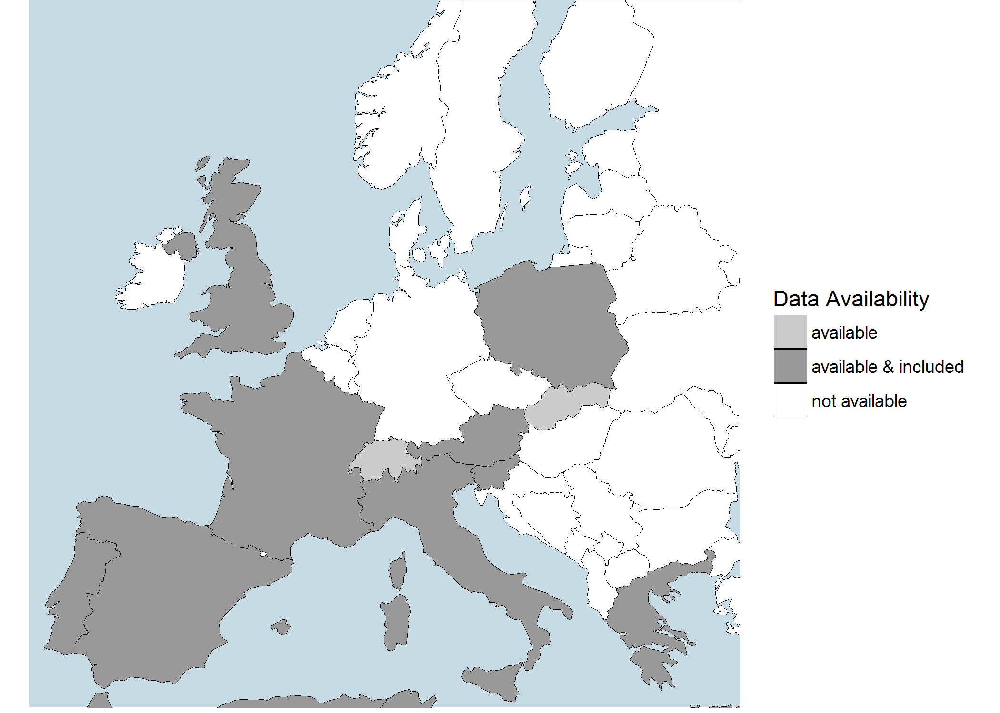

smires
================

SMIRES is a COST Action addressing the Science and Management of Intermittent Rivers & Ephemeral Streams. SMIRES brings together more than 200 hydrologists, biogeochemists, ecologists, modellers, environmental economists, social researchers and stakeholders from 31 different countries to develop a research network for synthesising the fragmented, recent knowledge on IRES, improving our understanding of IRES and translating this into a science-based, sustainable management of river networks. More information about SMIRES can be found at <http://www.smires.eu/>.

This git repository hosts the R-package `smires`, one of several outcomes of Working Group 1 (WG1, Prevalence, distribution and trends of IRES). Given time series of daily (weekly, monthly) discharges, its purpose is:

-   to identify gauging stations that have an IRES flow regime;
-   to calculate relevant flow and intermittency metrics.

Installation of the R-package
=============================

In order to use the development version of the package `smires` you will need to install the package `devtools` once.

``` r
install.packages("devtools")
```

It provides the convenient command `install_github()` which installs the most recent version of a package hosted on github. To do so, simply execute the following three lines:

``` r
library(devtools)
install_github("mundl/smires")
library(smires)
```

The current version is `0.5`. To load this package in an R session, `library(smires)` has to be called.

``` r
library(smires)
packageVersion("smires")
```

Vignettes
=========

The usage of the package is demonstrated in these four preliminary vignettes. They are currently under development.

-   The [concept](inst/demos/concept.html) of the R package **smires**

Examples
========

Each participating country was asked to suggest metrics and to submit a few time series with intermittent streamflow. As we plan to integrate the provided time series in the R package, we need permission of the copyright holder to make the data available. The column **include** of the following table indicates if the data can be published.

### Time Series

Currently `12` countries have submitted time series of which `10` countries agreed on indluding the data into the R-package.



<table>
<colgroup>
<col width="2%" />
<col width="10%" />
<col width="48%" />
<col width="2%" />
<col width="35%" />
</colgroup>
<thead>
<tr class="header">
<th align="left">country</th>
<th align="left">contact</th>
<th align="left">time series</th>
<th align="left">include</th>
<th align="left">comment</th>
</tr>
</thead>
<tbody>
<tr class="odd">
<td align="left">at</td>
<td align="left"><a href="mailto:t.gauste*@boku.ac.at">t.gauste*@boku.ac.at</a></td>
<td align="left">...</td>
<td align="left">TRUE</td>
<td align="left"></td>
</tr>
<tr class="even">
<td align="left">cy</td>
<td align="left"><a href="mailto:gdorflinge*@wdd.moa.gov.cy">gdorflinge*@wdd.moa.gov.cy</a></td>
<td align="left">Peristerona, Pouzis, Liopetri</td>
<td align="left">TRUE</td>
<td align="left"></td>
</tr>
<tr class="odd">
<td align="left">es</td>
<td align="left"><a href="mailto:luis.medier*@upm.es">luis.medier*@upm.es</a></td>
<td align="left">8060, 9052</td>
<td align="left">TRUE</td>
<td align="left"></td>
</tr>
<tr class="even">
<td align="left">fr</td>
<td align="left"><a href="mailto:ytrambla*@gmail.com">ytrambla*@gmail.com</a></td>
<td align="left">37 stations</td>
<td align="left">TRUE</td>
<td align="left"></td>
</tr>
<tr class="odd">
<td align="left">fr</td>
<td align="left"><a href="mailto:eric.sauque*@irstea.fr">eric.sauque*@irstea.fr</a></td>
<td align="left">H1333010, H1503910, H1513210, H1603010, H1713010, H1932020</td>
<td align="left">TRUE</td>
<td align="left"></td>
</tr>
<tr class="even">
<td align="left">gr</td>
<td align="left"><a href="mailto:rania.tzorak*@aegean.gr">rania.tzorak*@aegean.gr</a></td>
<td align="left">Vrontamas</td>
<td align="left">TRUE</td>
<td align="left"></td>
</tr>
<tr class="odd">
<td align="left">it</td>
<td align="left"><a href="mailto:giuseppe.verdian*@adb.puglia.it">giuseppe.verdian*@adb.puglia.it</a></td>
<td align="left">Carapelle Torrent</td>
<td align="left">TRUE</td>
<td align="left">Region Puglia</td>
</tr>
<tr class="even">
<td align="left">it</td>
<td align="left"><a href="mailto:annamaria.degirolam*@ba.irsa.cnr.it">annamaria.degirolam*@ba.irsa.cnr.it</a></td>
<td align="left">Celone, Salsola</td>
<td align="left">TRUE</td>
<td align="left"><a href="http://www.protezionecivile.puglia.it/centro-funzionale/analisielaborazione-dati/annali-idrologici-parte-ii">source</a></td>
</tr>
<tr class="odd">
<td align="left">pl</td>
<td align="left"><a href="mailto:kazimierz_banasi*@sggw.pl">kazimierz_banasi*@sggw.pl</a></td>
<td align="left">Plachty Stare</td>
<td align="left">TRUE</td>
<td align="left">uses hydrological year, starting with November</td>
</tr>
<tr class="even">
<td align="left">pl</td>
<td align="left"><a href="mailto:rmrutko*@cyf-kr.edu.pl">rmrutko*@cyf-kr.edu.pl</a></td>
<td align="left">Goryczkowa</td>
<td align="left">TRUE</td>
<td align="left">only 3 years of observation</td>
</tr>
<tr class="odd">
<td align="left">pt</td>
<td align="left"><a href="mailto:helena.alve*@apambiente.pt">helena.alve*@apambiente.pt</a></td>
<td align="left">Moinho da Gamitinha, Torrão do Alentejo</td>
<td align="left">TRUE</td>
<td align="left"><a href="http://snirh.pt/">source</a></td>
</tr>
<tr class="even">
<td align="left">uk</td>
<td align="left"><a href="mailto:catse*@ceh.ac.uk">catse*@ceh.ac.uk</a></td>
<td align="left">Balder at <a href="http://nrfa.ceh.ac.uk/data/station/info/25022">Balderhead Reservoir</a>, Ampney Brook at <a href="http://nrfa.ceh.ac.uk/data/station/info/39099">Ampney St Peter</a></td>
<td align="left">TRUE</td>
<td align="left">Balder: human influence, Ampney Brook: chalk stream that dries naturally</td>
</tr>
<tr class="odd">
<td align="left">sk</td>
<td align="left"><a href="mailto:kohnov*@stuba.sk">kohnov*@stuba.sk</a></td>
<td align="left">Cierna voda, Bodva, Chlmec, +4 stations</td>
<td align="left">FALSE</td>
<td align="left"></td>
</tr>
<tr class="even">
<td align="left">ch</td>
<td align="left"><a href="mailto:ilja.vanmeervel*@geo.uzh.ch">ilja.vanmeervel*@geo.uzh.ch</a></td>
<td align="left">Altlandenberg</td>
<td align="left"></td>
<td align="left"></td>
</tr>
<tr class="odd">
<td align="left">es</td>
<td align="left"><a href="mailto:francesc.gallar*@idaea.csic.es">francesc.gallar*@idaea.csic.es</a></td>
<td align="left">Riu Manol</td>
<td align="left"></td>
<td align="left"></td>
</tr>
<tr class="even">
<td align="left">lt</td>
<td align="left"><a href="mailto:hydr*@mail.lei.lt">hydr*@mail.lei.lt</a></td>
<td align="left"></td>
<td align="left"></td>
<td align="left"></td>
</tr>
<tr class="odd">
<td align="left">pt</td>
<td align="left"><a href="mailto:teresa*@ipcb.pt">teresa*@ipcb.pt</a></td>
<td align="left">Coruche, Monforte, Pavia, Moinho</td>
<td align="left"></td>
<td align="left"></td>
</tr>
<tr class="even">
<td align="left">si</td>
<td align="left"><a href="mailto:simon.rusja*@fgg.uni-lj.si">simon.rusja*@fgg.uni-lj.si</a></td>
<td align="left">13 station of which 7 are intermittent</td>
<td align="left"></td>
<td align="left"></td>
</tr>
</tbody>
</table>

<!--### Metrics -->
Getting in Contact
==================

In case you are interested or you want to contribute to the package `smires` (even though you are not part of the [SMIRES cost action](http://www.smires.eu/)) please contact <t.gauster@boku.ac.at>.
